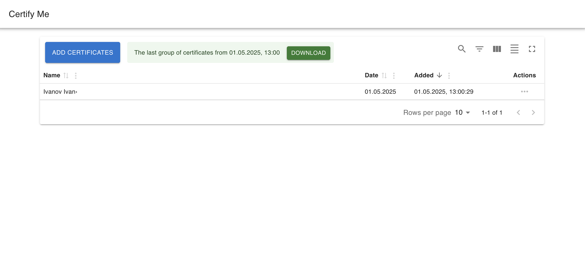
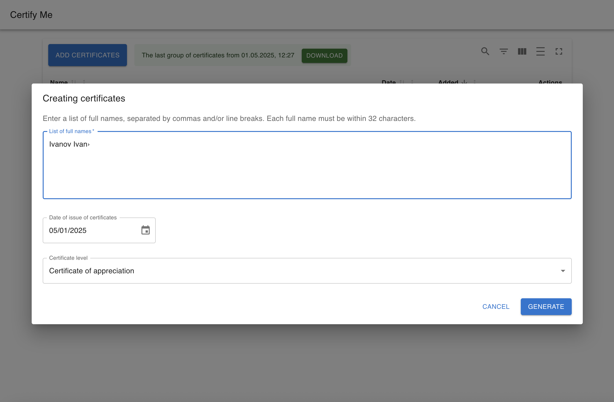
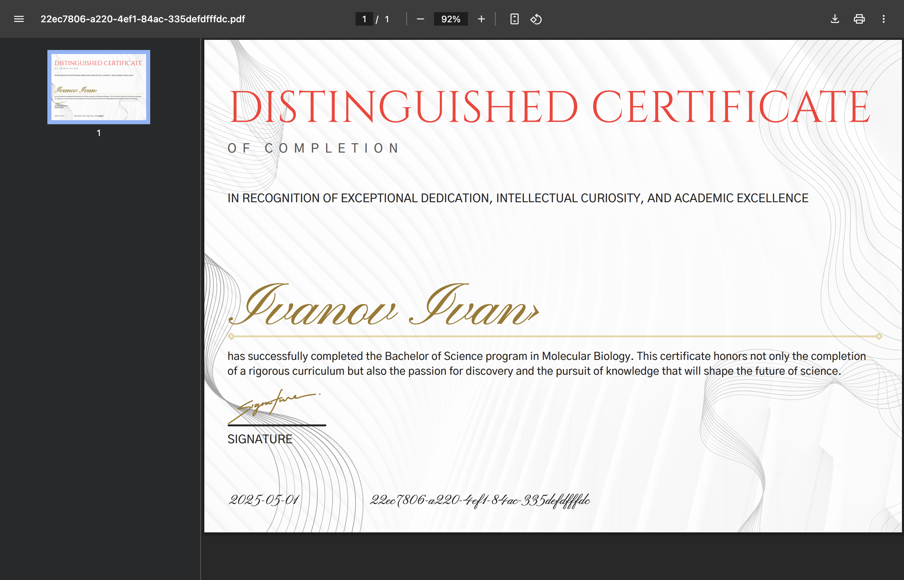

# 🎓 CertifyMe — Certificate Generator

A simple and customizable certificate generator that allows users to generate professional-looking certificates with name, date, course ID, and more. Perfect for online learning platforms, workshops, or internal training systems.

## 🔧 Features

- Generate certificates in PDF format
- Customizable templates via backend config
- Support for multiple **certificate levels** (e.g., basic, advanced, distinguished)
- Configurable design: font size, color, position of text elements (name, date, title)
- Easy integration into educational tools and LMS platforms

## 💡 Tech Stack

- **Frontend**: React, TypeScript
- **Backend**: Python (Flask)
- **PDF generation**: PyPDF2, Reportlab

## 🚀 Usage Example

1. Enter user details (name, date, ID)
2. Select certificate level (template)
3. Click "Generate" → Download a ready-to-print PDF or download an archive with the latest certificates 

## Screens

## TODO
- localization